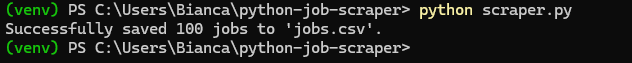
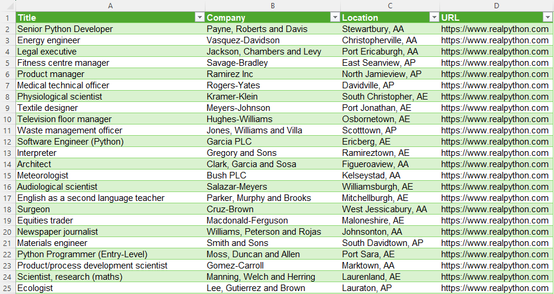

# 📋 Python Job Listings Scraper 


A Python web scraper that collects job listings from the **Fake Python Jobs** website using **Requests** and **BeautifulSoup**.

The application extracts structured job information and exports the results into a CSV file.

---

# 📖 Overview

It demonstrates how to:

- Download webpages with HTTP requests
- Parse HTML documents
- Extract structured information
- Export data to CSV
- Organize code into reusable functions
- Handle common exceptions gracefully

---

# 🧩 Features

- Retrieve job listings from the Fake Python Jobs website
- Extract:
  - Job Title
  - Company Name
  - Location
  - Job Detail URL
- Save results to a CSV file
- Handle missing HTML elements
- Clean and modular code structure

---

# 🤖 Requirements

- Python 3.13+
- Requests
- BeautifulSoup4
- CSV (Python Standard Library)

---

# 📁 Project Structure

```text
python-job-scraper/
│
├── .github/
│   └── workflows/
│       └── python.yml
│
├── screenshots/
│   └── output.png
│
├── scraper.py
├── jobs.csv
├── requirements.txt
├── README.md
├── LICENSE
└── .gitignore
```

---

# ⚙️ Installation

Clone the repository:

```bash
git clone https://github.com/biagasparino/python-job-scraper.git
```

Navigate to the project folder:

```bash
cd python-job-scraper
```

Create a virtual environment:

### Windows

```bash
python -m venv venv
venv\Scripts\activate
```

### Linux / macOS

```bash
python3 -m venv venv
source venv/bin/activate
```

Install dependencies:

```bash
python -m pip install -r requirements.txt
```

---

# ▶️ Usage

Run the application:

```bash
python scraper.py
```

Expected output:

```text
Successfully saved 100 jobs to jobs.csv
```

---

# 📄 Output

The scraper generates a CSV file named:

```text
jobs.csv
```

The repository already includes a sample output file so visitors can quickly see the expected result.

| Column | Description |
|---------|-------------|
| Title | Job title |
| Company | Company name |
| Location | Job location |
| URL | Job detail page |

# 📸 Example Output

After running the scraper, a CSV file is generated with the extracted job listings.

# 🔳 Terminal



# 🧾 Generated CSV




---

# 💡 How It Works

The application follows these steps:

1. Send an HTTP request to the website.
2. Download the HTML.
3. Parse the HTML using BeautifulSoup.
4. Locate every job card.
5. Extract the required fields.
6. Store the information in Python dictionaries.
7. Export the collected data into a CSV file.

---

# 🛡️ Error Handling

The scraper includes basic exception handling.

It gracefully handles:

- Connection errors
- HTTP request failures
- Missing HTML elements

If a field is unavailable, the application stores:

```text
N/A
```

instead of stopping unexpectedly.

---

# 📚 What I Learned

This project helped me practice:

- HTTP requests with Requests
- HTML parsing using BeautifulSoup
- Web page inspection
- Python functions
- Dictionaries
- Lists
- CSV generation
- Exception handling
- Project organization
- Writing maintainable Python code

---

# 🌐 Data Source

The project uses the educational website: https://realpython.github.io/fake-jobs/

---

# 🎯 Project Goals

The objective of this project was to:

- Learn the fundamentals of Web Scraping
- Practice Requests and BeautifulSoup
- Improve Python programming skills
- Build a portfolio-ready application

---

# 📄 License

This project is licensed under the MIT License.

---

🤝🏻 Acknowledgements: 

This project was inspired by the **Python Job Listings Scraper** challenge from roadmap.sh.

The implementation, code structure, and documentation in this repository were developed independently as part of my learning journey.

---

❗ Note: This project depends on the availability of the Fake Python Jobs website. If the website is temporarily unavailable, the GitHub Actions workflow may fail even though the code is correct.

---

# 👩🏻‍💻 Author

Bianca Gasparino de Campos

Thank you for visiting this repository!
